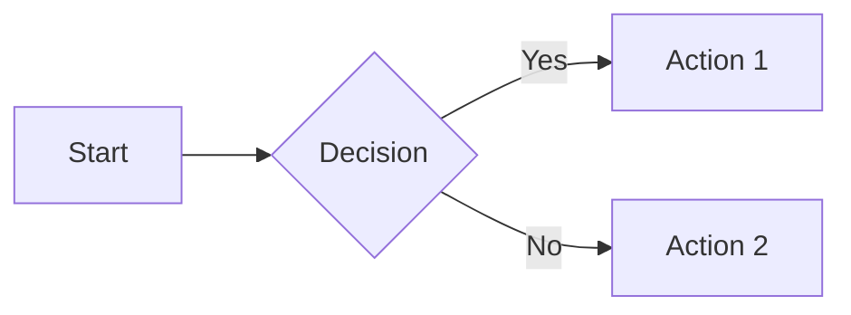
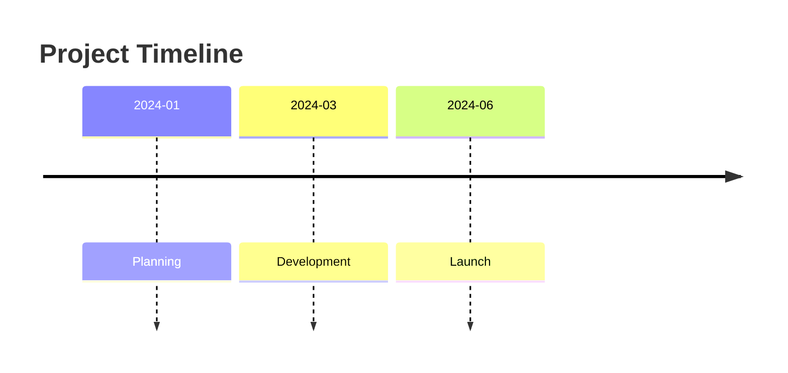
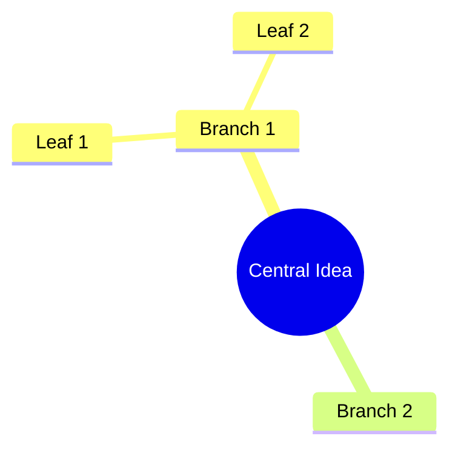

# Week 3: Creative Outputs

**Theme:** "From notes to assets that impress."
**Days:** 15-21
**Fictional Context:** Creating Thistle & Thorn's marketing materials

---

## Week 3 Overview

### Learning Objectives
By the end of Week 3, students will be able to:
1. Generate presentation outlines ready for Gamma
2. Create detailed image prompts for Gemini/AI image generators
3. Write SSML-formatted scripts for ElevenLabs
4. Build process diagrams with Mermaid
5. Create social media content from long-form notes
6. Write video briefs for HeyGen avatars
7. Generate cinematic video prompts for Kling

### Week 3 Outcome
Students can transform any structured note into visual, audio, and video production briefs.

### Thistle & Thorn Context
Jamie needs to create marketing materials for the Christmas campaign:
- Presentation for a potential distributor
- Social media content for Instagram and LinkedIn
- Audio for a podcast episode
- Video content for the website
- Diagrams explaining the whisky-making process

### Required Tool Accounts
| Tool | Purpose | Free Tier |
|------|---------|-----------|
| Gamma | Presentations | Limited |
| Google AI Studio / Gemini | Image generation | Yes |
| ElevenLabs | Voice synthesis | Limited |
| HeyGen | Video avatars | Limited |
| Kling | Video generation | Yes |
| Mermaid | Diagrams | Free (built-in) |

---

## Day 15: Presentation Builder

**Slash Command:** `/w3.d15`
**Title:** Creating Presentation Outlines for Gamma
**Duration:** Video 9 mins, Hands-on 15 mins

### Learning Objectives
- Transform notes into presentation structures
- Understand Gamma's import format
- Create compelling slide narratives
- Design for impact, not information overload

### The Scenario
Fiona has a meeting with a potential Edinburgh distributor. She has notes from previous conversations but no deck. Jamie needs to create a compelling presentation.

### Video Content
1. **Hook:** "Notes to presentation in 5 minutes. No design skills required."
2. **Demo:**
   - Taking meeting notes and distilling key messages
   - Creating Gamma-ready outline
   - Importing into Gamma
   - Quick customisation
3. **Key moments:**
   - Show notes → outline transformation
   - Gamma import in action
   - Before/after comparison

### Slash Command Structure

```markdown
# Day 15: Presentation Builder

Transform your notes into presentation-ready outlines.

## What We're Building
A Gamma-ready presentation outline from your notes, with
compelling structure and clear messaging.

## The Scenario
Fiona needs a deck for Edinburgh Spirits Distributors. She has:
- Notes from a discovery call
- Key points about Thistle & Thorn
- Pricing information

Jamie needs to create a 10-slide deck. No design skills needed.

## Presentation Principles

1. **One idea per slide** - Don't cram
2. **Headlines that stand alone** - Each slide title tells the story
3. **Start with why** - Problem before solution
4. **End with action** - What do you want them to do?

## Gamma Import Format

Gamma works best with:
- Clear hierarchy (# for slide titles)
- Bullet points for key messages
- Simple markdown formatting

## Let's Go

### Step 1: Create the Presentation Builder
"Create a slash command at .claude/commands/build-presentation.md:

# Build Presentation Outline

You are helping me create a presentation outline ready for
Gamma import.

## Input
I'll provide:
- Topic or purpose of the presentation
- Any source notes or content
- Target audience
- Desired length (number of slides)

## Your Task
Create a presentation outline with:

1. **Title Slide**
   - Compelling headline
   - Subtitle with context

2. **Problem/Opportunity Slide**
   - Why this matters to the audience

3. **Content Slides** (as many as needed)
   - One key message per slide
   - 3-4 supporting bullet points
   - Suggestion for visual if applicable

4. **Call to Action Slide**
   - Clear next step
   - Contact information

## Output Format
Markdown with # for slide titles, ## for slide subtitles,
and - for bullet points. Add [VISUAL: description] notes
for images/charts.

Keep it punchy. Less text = better slides."

### Step 2: Build the Distributor Deck
"Using my presentation builder, create a 10-slide deck for
Thistle & Thorn's meeting with Edinburgh Spirits Distributors.

Context:
- Thistle & Thorn is a craft whisky distillery in Speyside
- 4th generation family owned
- Products: Single malt (12yr, 18yr), seasonal gin
- Looking for Edinburgh distribution partner
- Key selling points: authenticity, craft quality, growing demand

Audience: Distribution manager, interested in premium spirits
Goal: Get them to agree to a trial order

Save to week-3-outputs/edinburgh-distributor-deck.md"

### Step 3: Review and Refine
"Review the deck outline. For each slide:
- Is the headline compelling enough to stand alone?
- Are there too many bullets?
- Suggest one improvement per slide"

### Step 4: Create a Quick Version
"Create a slash command build-presentation-quick.md that
creates a 5-slide deck outline: Title, Problem, Solution,
Proof, Action. Ultra-concise."

### Step 5: Export for Gamma
"Format the deck outline for direct Gamma import. Remove any
notes or comments. Clean markdown only."

## Importing to Gamma

1. Go to gamma.app
2. Click "Create New" → "Import"
3. Paste your markdown outline
4. Gamma generates designed slides
5. Customise colours/fonts as needed

## Sample Notes to Practice

Here are Jamie's notes for the distributor meeting:

---
Edinburgh Spirits call - key points:
- They're looking for premium Scottish spirits
- Current gap: authentic craft whisky (not industrial)
- Their buyers want a story
- Trial order minimum: 50 cases
- 30% margin expected
- They handle all Edinburgh bars and restaurants
- Growing demand for local/authentic
- They liked our Instagram content
- Fiona could do a tasting event for their buyers
---

## Your Turn
Take notes from a real presentation you need to create.
Run them through the presentation builder. Import to Gamma.

## What You Learned
- Notes → outline → designed deck
- One idea per slide
- Headlines should tell the story alone
- Gamma does the design work

## Tomorrow
Day 16: Image Prompter - Generating Gemini image prompts
Run `/w3.d16` when you're ready!

---
Day 15 of 31 | CoEngineers.ai
```

### Example Outputs
- `.claude/commands/build-presentation.md`
- `.claude/commands/build-presentation-quick.md`
- `edinburgh-distributor-deck.md`

---

## Day 16: Image Prompter

**Slash Command:** `/w3.d16`
**Title:** Generating AI Image Prompts
**Duration:** Video 9 mins, Hands-on 15 mins

### Learning Objectives
- Write detailed prompts for AI image generation
- Understand style, composition, and lighting descriptions
- Create consistent visual styles across multiple images
- Use Gemini (Google AI Studio) effectively

### The Scenario
Jamie needs images for the Christmas campaign: product shots, lifestyle images, and social media graphics. Photographer is too expensive. AI generation is the answer.

### Video Content
1. **Hook:** "Professional-looking images. Zero photography budget."
2. **Demo:**
   - Anatomy of a good image prompt
   - Style consistency across images
   - Using Gemini for generation
   - Iterating on prompts
3. **Key moments:**
   - Show prompt → image transformation
   - Compare good vs bad prompts
   - Create a consistent series

### Slash Command Structure

```markdown
# Day 16: Image Prompter

Create detailed prompts for AI image generation.

## What We're Building
A set of detailed image prompts for Gemini that produce
consistent, professional-looking images.

## The Scenario
Jamie needs 5 images for the Christmas campaign:
1. Hero product shot of the 12-year whisky
2. Lifestyle shot: whisky by a fireplace
3. Behind-the-scenes: cask warehouse
4. Christmas theme: gift packaging
5. Social media: quote graphic background

## Anatomy of a Good Prompt

```
[Subject] + [Style] + [Composition] + [Lighting] + [Mood] + [Technical]

Example:
"A bottle of single malt whisky on a rustic oak table,
product photography style, centered composition with
shallow depth of field, warm golden hour lighting from
the left, cozy and inviting mood, 4K, photorealistic"
```

## Style Consistency

For a coherent campaign, define:
- **Colour palette:** Warm ambers, deep browns, cream whites
- **Lighting style:** Warm, natural, golden
- **Photography style:** Lifestyle/editorial, not clinical
- **Mood:** Cozy, authentic, premium

## Let's Go

### Step 1: Create the Image Prompter
"Create a slash command at .claude/commands/create-image-prompt.md:

# Create Image Prompt

You are helping me write detailed prompts for AI image generation
(Gemini, DALL-E, Midjourney).

## Input
I'll describe:
- What I want in the image
- The intended use (social media, website, print)
- Any style preferences

## Your Task
Create a detailed prompt including:

1. **Subject** - What's in the image
2. **Style** - Photography/illustration style
3. **Composition** - How elements are arranged
4. **Lighting** - Type, direction, quality
5. **Colours** - Palette and tones
6. **Mood** - Emotional feeling
7. **Technical** - Quality descriptors (4K, photorealistic, etc.)

## Output Format
Provide:
- The full prompt (ready to paste into Gemini)
- 2-3 variations with different approaches
- Negative prompt (what to avoid)

Keep prompts under 100 words each."

### Step 2: Create the Campaign Images
"Create image prompts for Thistle & Thorn's Christmas campaign:

1. Hero product shot: 12-year single malt whisky bottle
   - Premium feel, gift-worthy
   - For website hero banner

2. Lifestyle: Whisky being enjoyed by a fireplace
   - Cozy, inviting, winter evening
   - For Instagram

3. Behind-the-scenes: The cask warehouse
   - Authentic, heritage feel
   - For brand storytelling

4. Christmas: Gift box with whisky and glasses
   - Festive but elegant
   - For promotional materials

5. Quote background: Abstract warm texture
   - For overlaying text
   - Instagram quotes

Create all 5 prompts with consistent style.
Save to week-3-outputs/christmas-campaign-prompts.md"

### Step 3: Create Style Guide Prompt
"Create a 'style guide' section at the top of the prompts file
that defines the consistent elements across all images. Someone
should be able to use this to create new images in the same style."

### Step 4: Test in Gemini
Take one prompt and run it in Google AI Studio:

1. Go to aistudio.google.com
2. Select Gemini with image generation
3. Paste your prompt
4. Generate and iterate

### Step 5: Iteration Prompt
"Create a slash command improve-image-prompt.md that takes a
prompt and an issue (e.g., 'too dark', 'wrong style') and
improves the prompt to fix it."

## Prompt Patterns That Work

**For products:**
"Product photography of [item], [surface/background], studio
lighting, [brand mood], commercial quality, 4K"

**For lifestyle:**
"[Person/scene] with [product], [location], natural lighting,
[mood], editorial photography style, shallow depth of field"

**For textures/backgrounds:**
"Abstract [texture type], [colour palette], soft gradients,
suitable for text overlay, [mood], high resolution"

## Your Turn
Create 3 image prompts for something you actually need:
- A product you're selling
- A blog post header
- A social media graphic

Generate them in Gemini and iterate.

## What You Learned
- Detailed prompts = better images
- Consistency comes from defined style elements
- Iteration is normal and expected
- Structure: subject + style + composition + lighting + mood

## Tomorrow
Day 17: Audio Script Writer - Creating ElevenLabs scripts
Run `/w3.d17` when you're ready!

---
Day 16 of 31 | CoEngineers.ai
```

### Example Outputs
- `.claude/commands/create-image-prompt.md`
- `.claude/commands/improve-image-prompt.md`
- `christmas-campaign-prompts.md` with 5 prompts + style guide

---

## Day 17: Audio Script Writer

**Slash Command:** `/w3.d17`
**Title:** Writing Scripts for ElevenLabs
**Duration:** Video 8 mins, Hands-on 12 mins

### Learning Objectives
- Write scripts optimised for text-to-speech
- Use SSML tags for pauses and emphasis
- Create natural-sounding audio content
- Prepare scripts for ElevenLabs voices

### The Scenario
Thistle & Thorn wants to create audio content: podcast snippets, video voiceovers, and audio guides for distillery tours. ElevenLabs will generate the voice.

### Video Content
1. **Hook:** "Your brand voice. Without hiring voice talent."
2. **Demo:**
   - Writing for ear vs eye
   - SSML basics (pauses, emphasis)
   - Running through ElevenLabs
   - Adjusting for natural sound
3. **Key moments:**
   - Show script → audio transformation
   - Before/after with SSML tags
   - Natural vs robotic comparison

### Slash Command Structure

```markdown
# Day 17: Audio Script Writer

Create scripts optimised for AI voice generation.

## What We're Building
Voice-ready scripts with SSML markup for natural-sounding
ElevenLabs audio.

## The Scenario
Thistle & Thorn needs:
- A 60-second brand story for the website
- Distillery tour audio guide snippets
- Podcast intro/outro

Jamie will write the scripts. ElevenLabs will voice them.

## Writing for Ear vs Eye

**Reading:** "Thistle & Thorn Distillery, est. 1892, produces
premium single malt whisky using traditional methods."

**Listening:** "Thistle and Thorn has been making whisky
since eighteen ninety-two. Four generations of the MacTavish
family, using the same methods their great-grandfather used."

Key differences:
- Shorter sentences
- Write numbers as spoken
- Add pauses for emphasis
- Use contractions (we're, it's)
- Avoid acronyms

## SSML Basics

```xml
<speak>
  Welcome to Thistle and Thorn.
  <break time="0.5s"/>
  We've been making whisky for over a century.
  <emphasis level="strong">Four generations</emphasis>
  of craft and tradition.
</speak>
```

Common tags:
- `<break time="Xs"/>` - Pause for X seconds
- `<emphasis level="strong/moderate">` - Stress words
- `<prosody rate="slow/medium/fast">` - Speaking speed

## Let's Go

### Step 1: Create the Audio Script Writer
"Create a slash command at .claude/commands/write-audio-script.md:

# Write Audio Script

You are helping me write scripts for text-to-speech generation
(ElevenLabs, etc.).

## Input
I'll provide:
- The content or topic
- Target length (in seconds or words)
- Tone (professional, warm, energetic, etc.)
- Where it will be used (website, podcast, tour, etc.)

## Your Task
Create a voice-optimised script with:

1. **Natural language** - Write for listening, not reading
2. **Appropriate pacing** - Short sentences, natural pauses
3. **SSML markup** - Breaks, emphasis where helpful
4. **Pronunciation guides** - For unusual words

## Output Format
Provide:
- Clean script (no SSML, for preview)
- SSML version (for ElevenLabs)
- Word count and estimated duration (150 words ≈ 1 minute)
- Voice recommendations (warm, authoritative, etc.)

Use British English. Natural and conversational."

### Step 2: Create the Brand Story Script
"Write a 60-second audio script for Thistle & Thorn's website
homepage.

Content to cover:
- Fourth generation family distillery
- Speyside location
- Traditional methods
- Premium single malt and seasonal gin
- Visitor experiences available

Tone: Warm, proud, inviting
Voice: Soft Scottish accent (suggest ElevenLabs voice)

Save to week-3-outputs/brand-story-audio.md"

### Step 3: Create Tour Guide Snippets
"Write 3 short (20-second each) audio snippets for a distillery
tour:

1. Welcome to the Visitor Centre
2. Entering the Cask Warehouse
3. The Tasting Room

Each should be standalone. Include SSML for dramatic pauses.
Save to week-3-outputs/tour-audio-snippets.md"

### Step 4: Test in ElevenLabs
1. Go to elevenlabs.io
2. Paste your SSML script
3. Select a voice (try "Charlie" for warm British)
4. Generate and listen
5. Iterate on script as needed

### Step 5: Create a Quick Version
"Create write-audio-quick.md that takes any text and converts
it to a spoken-word script with appropriate pauses. No SSML,
just natural language."

## Pronunciation Guide for Thistle & Thorn

| Word | Pronunciation |
|------|---------------|
| Speyside | SPAY-side |
| Whisky | WISS-key (not whis-KEY) |
| MacTavish | Mac-TAV-ish |
| Cask | Cahsk (soft 'a') |

## Your Turn
Write an audio script for something you need:
- A welcome message
- An explainer video voiceover
- A podcast intro

Generate it in ElevenLabs and iterate.

## What You Learned
- Writing for ear is different from eye
- Short sentences and pauses matter
- SSML adds natural emphasis
- Iteration improves naturalness

## Tomorrow
Day 18: Diagram Generator - Building Mermaid diagrams
Run `/w3.d18` when you're ready!

---
Day 17 of 31 | CoEngineers.ai
```

### Example Outputs
- `.claude/commands/write-audio-script.md`
- `.claude/commands/write-audio-quick.md`
- `brand-story-audio.md` with clean and SSML versions
- `tour-audio-snippets.md`

---

## Day 18: Diagram Generator

**Slash Command:** `/w3.d18`
**Title:** Building Mermaid Diagrams
**Duration:** Video 8 mins, Hands-on 12 mins

### Learning Objectives
- Create flowcharts and process diagrams
- Build relationship diagrams
- Generate timelines and sequences
- Use Mermaid syntax effectively

### The Scenario
Fiona wants to explain the whisky-making process to visitors. Old Hamish knows every step but it's all in his head. Time to visualise it.

### Video Content
1. **Hook:** "Complex processes. Clear diagrams. Zero design work."
2. **Demo:**
   - Mermaid syntax basics
   - Creating a flowchart
   - Rendering in Obsidian/VS Code
   - Different diagram types
3. **Key moments:**
   - Show text → diagram transformation
   - Multiple diagram types
   - Embed in markdown

### Slash Command Structure

```markdown
# Day 18: Diagram Generator

Create clear diagrams from plain text descriptions.

## What We're Building
Process diagrams, flowcharts, and relationship maps using
Mermaid syntax.

## The Scenario
Old Hamish has made whisky for 40 years. The process is in his
head. We need to document it visually before he retires.

## Mermaid Basics

Mermaid creates diagrams from text. Renders in:
- Obsidian (built-in)
- VS Code (with extension)
- GitHub markdown
- Many documentation tools

## Diagram Types

1. **Flowchart** - Processes with decisions
2. **Sequence** - Step-by-step interactions
3. **Timeline** - Events over time
4. **Entity Relationship** - How things connect
5. **Mindmap** - Hierarchical ideas

## Let's Go

### Step 1: Create the Diagram Generator
"Create a slash command at .claude/commands/create-diagram.md:

# Create Mermaid Diagram

You are helping me create diagrams using Mermaid syntax.

## Input
I'll describe:
- What I want to visualise
- The type of diagram (or ask for recommendation)
- Level of detail needed

## Your Task
Create a Mermaid diagram with:

1. **Appropriate type** - Match the content to the right diagram
2. **Clear labels** - Readable node/edge text
3. **Logical flow** - Left-to-right or top-to-bottom
4. **Proper syntax** - Valid Mermaid code

## Output Format
Provide:
- The Mermaid code block
- Brief explanation of the diagram
- Suggestions for improvements
- Alternative diagram type if applicable

Code should be in a mermaid code block for easy rendering."

### Step 2: The Whisky-Making Process
"Create a flowchart showing the whisky-making process:

1. Malting - Barley is soaked and germinated
2. Mashing - Ground malt mixed with hot water
3. Fermentation - Yeast added, creates wash
4. Distillation - Wash heated in copper stills (x2)
5. Maturation - Stored in oak casks for years
6. Bottling - Final product

Show the main flow with brief descriptions.
Save to week-3-outputs/whisky-process-diagram.md"

### Step 3: Create Different Diagram Types
"Using the same whisky-making content, create:

1. A timeline showing the process duration
   - Malting: 3 days
   - Mashing: 8 hours
   - Fermentation: 3 days
   - Distillation: 1 day
   - Maturation: 12 years
   - Bottling: 1 day

2. A mindmap of all the factors affecting whisky quality

Save both to week-3-outputs/"

### Step 4: Create a Sequence Diagram
"Create a sequence diagram showing the customer journey:

1. Customer discovers Thistle & Thorn (website/social)
2. Customer signs up for newsletter
3. Customer receives welcome email
4. Customer books distillery tour
5. Customer visits and tastes
6. Customer purchases whisky
7. Customer shares on social media
8. New customer discovers via share

Show the interactions between Customer, Website, Email, and Staff."

### Step 5: Quick Diagram Command
"Create a slash command create-flowchart.md that just creates
flowcharts from a list of steps. Ultra simple input format."

## Mermaid Syntax Quick Reference

**Flowchart:**


**Timeline:**


**Mindmap:**


## Your Turn
Create a diagram for something in your work:
- A process you follow
- A decision tree
- A project timeline
- An organisational structure

## What You Learned
- Text → diagram with Mermaid
- Multiple diagram types for different needs
- Renders in most documentation tools
- No design skills required

## Tomorrow
Day 19: Social Thread Maker - Creating social content
Run `/w3.d19` when you're ready!

---
Day 18 of 31 | CoEngineers.ai
```

### Example Outputs
- `.claude/commands/create-diagram.md`
- `.claude/commands/create-flowchart.md`
- `whisky-process-diagram.md`
- Timeline and mindmap diagrams

---

## Day 19: Social Thread Maker

**Slash Command:** `/w3.d19`
**Title:** Creating Social Media Content
**Duration:** Video 8 mins, Hands-on 15 mins

### Learning Objectives
- Break long-form content into social posts
- Write platform-specific content (Twitter/X, LinkedIn)
- Create hooks that stop the scroll
- Build content series and threads

### The Scenario
Jamie has blog posts, notes, and ideas but no social media content. Every platform is different. Time to create a content engine.

### Video Content
1. **Hook:** "One idea. Five platforms. Zero extra writing."
2. **Demo:**
   - Analysing content for social potential
   - Writing hooks that work
   - Platform-specific formatting
   - Creating threads and carousels
3. **Key moments:**
   - Long-form → thread transformation
   - Good vs bad hooks
   - LinkedIn vs Twitter differences

### Slash Command Structure

```markdown
# Day 19: Social Thread Maker

Transform long-form content into engaging social media posts.

## What We're Building
Social media content for multiple platforms from your
existing notes and content.

## The Scenario
Jamie wrote a blog post about "Why Craft Whisky Beats Mass
Market." Now they need:
- A Twitter/X thread
- LinkedIn posts
- Instagram captions

One piece of content, multiple platforms.

## Platform Differences

**Twitter/X:**
- 280 characters
- Threads for longer content
- Hooks are everything
- Casual, punchy tone

**LinkedIn:**
- Longer posts OK (3000 chars)
- More professional tone
- Stories perform well
- Line breaks for readability

**Instagram:**
- Image-first
- Captions up to 2200 chars
- Hashtags matter
- More emotional/visual language

## Let's Go

### Step 1: Create the Social Content Generator
"Create a slash command at .claude/commands/create-social.md:

# Create Social Media Content

You are helping me turn content into social media posts.

## Input
I'll provide:
- Source content (notes, blog post, idea)
- Target platform(s)
- Tone preference
- Call to action (if any)

## Your Task
Create platform-specific content:

**For Twitter/X:**
- Hook tweet (stops the scroll)
- Thread if content is substantial (numbered)
- Each tweet under 280 chars
- End with CTA

**For LinkedIn:**
- Hook (first line visible before 'see more')
- Story structure or key points
- Professional but human tone
- CTA in final paragraph

**For Instagram:**
- Caption with hook
- Emoji usage (moderate)
- Hashtag suggestions (10-15)
- CTA

## Hook Formulas That Work
- Contrarian: 'Unpopular opinion: [thing]'
- Numbers: '5 things I learned about [X]'
- Story: 'I used to think [X]. Then [Y] happened.'
- Question: 'Why do most [X] fail at [Y]?'

## Output Format
Separate sections for each platform. Ready to copy and paste."

### Step 2: Create Thistle & Thorn Social Content
"Create social content from this blog post outline:

Title: Why Craft Whisky Beats Mass Market (Every Time)

Key points:
- Mass market whisky is blended for consistency, not character
- Craft distilleries use local ingredients, unique water sources
- You can taste the place in craft whisky
- Small batches mean the distiller knows every cask
- The story matters - who made this, why, how
- Craft whisky supports local economy and traditions
- Price reflects care, not just marketing

Create:
1. Twitter/X thread (7 tweets)
2. LinkedIn post
3. Instagram caption

Save to week-3-outputs/craft-whisky-social.md"

### Step 3: Create a Hook Generator
"Create a slash command create-hooks.md that takes a topic
and generates 10 different hooks using different formulas
(contrarian, numbers, story, question, etc.)."

### Step 4: Content Calendar Helper
"Create a slash command plan-social-week.md that takes
a topic or content piece and suggests 5 different posts
for the week, each with a different angle."

### Step 5: Carousel Outline
"Create a 10-slide Instagram carousel outline from the
craft whisky content. Each slide should have a headline
and 1-2 bullet points. First slide is the hook."

## Hook Formulas

| Formula | Example |
|---------|---------|
| Contrarian | "Expensive whisky is often worse than £30 bottles" |
| Numbers | "3 things every whisky label is hiding from you" |
| Story | "My grandfather's distillery almost closed. Here's what saved it." |
| Question | "Why do Japanese whiskies win so many awards?" |
| Challenge | "Stop buying whisky based on age. Here's what actually matters." |
| Behind the scenes | "This is what happens in a cask for 12 years" |

## Your Turn
Take a piece of content you've created and run it through
the social content generator. Create posts for at least
2 platforms.

## What You Learned
- One idea = multiple platform posts
- Hooks are the most important element
- Each platform has different norms
- Repurposing beats creating from scratch

## Tomorrow
Day 20: Video Brief Creator - Writing HeyGen scripts
Run `/w3.d20` when you're ready!

---
Day 19 of 31 | CoEngineers.ai
```

### Example Outputs
- `.claude/commands/create-social.md`
- `.claude/commands/create-hooks.md`
- `.claude/commands/plan-social-week.md`
- `craft-whisky-social.md` with multi-platform content

---

## Day 20: Video Brief Creator

**Slash Command:** `/w3.d20`
**Title:** Creating HeyGen Video Scripts
**Duration:** Video 9 mins, Hands-on 15 mins

### Learning Objectives
- Write scripts for AI avatar videos
- Include scene directions and timing
- Create talking head video content
- Prepare for HeyGen generation

### The Scenario
Thistle & Thorn wants video content for the website but can't afford a film crew. HeyGen avatars can deliver brand messages. Jamie needs to write the scripts.

### Video Content
1. **Hook:** "Professional video content. No camera. No crew."
2. **Demo:**
   - Writing for avatar delivery
   - Scene directions and transitions
   - HeyGen import and generation
   - Tips for natural results
3. **Key moments:**
   - Show script → video transformation
   - Good vs awkward pacing
   - Scene variation techniques

### Slash Command Structure

```markdown
# Day 20: Video Brief Creator

Create production briefs for HeyGen avatar videos.

## What We're Building
Complete video scripts with scene directions, ready for
HeyGen avatar generation.

## The Scenario
Thistle & Thorn needs:
- A welcome video for the website
- Product explainer videos
- FAQ responses

No film crew. No expensive production. Just HeyGen.

## HeyGen Basics

HeyGen creates talking head videos with:
- AI avatars (or your own)
- Text-to-speech voices
- Scene transitions
- Background changes

## Script Structure for Avatars

```
SCENE 1: [Background description]
[Avatar action: e.g., "smiling, looking at camera"]

DIALOGUE:
"Welcome to Thistle and Thorn..."

[Pause: 1 second]

SCENE 2: [Background description]
...
```

## Let's Go

### Step 1: Create the Video Brief Creator
"Create a slash command at .claude/commands/create-video-brief.md:

# Create Video Brief

You are helping me create video scripts for HeyGen avatar
generation.

## Input
I'll provide:
- Video topic/purpose
- Target length (in seconds/minutes)
- Key messages to convey
- Tone (professional, friendly, energetic)
- Where it will be used

## Your Task
Create a video script with:

1. **Video Overview**
   - Title
   - Duration
   - Purpose
   - Avatar suggestions

2. **Scene-by-Scene Script**
   - Scene number and description
   - Background suggestion
   - Avatar expression/gesture
   - Dialogue (written for speaking)
   - Pause markers
   - Transitions

3. **Technical Notes**
   - Pacing guidance
   - Music suggestions (if any)
   - Text overlays needed

## Output Format
Production-ready script with clear scene breaks.
Dialogue written for natural speech (contractions, pauses).
Keep individual scenes under 30 seconds for best results."

### Step 2: Create Welcome Video Script
"Create a 90-second welcome video script for Thistle & Thorn's
website homepage.

Messages to convey:
- Welcome to our distillery
- Four generations of whisky-making
- We're in the heart of Speyside
- Visit us for tours and tastings
- Sign up for the newsletter for exclusive releases

Tone: Warm, inviting, proud but not boastful
Avatar: Professional woman, 40s, friendly smile

Save to week-3-outputs/welcome-video-brief.md"

### Step 3: Create Product Video Series
"Create briefs for 3 short (30-second) product videos:

1. The 12-Year Single Malt - our signature whisky
2. The Thistle Gin - seasonal small batch
3. The Distillery Experience - tours and tastings

Each should follow the same format for consistency.
Save to week-3-outputs/product-video-briefs.md"

### Step 4: FAQ Video Generator
"Create a slash command create-faq-video.md that takes a
question and answer and creates a 30-second video script
for a friendly FAQ response."

### Step 5: Prepare for HeyGen
"Add a section to welcome-video-brief.md with:
- HeyGen avatar recommendations
- Voice selections (match Scottish tone if possible)
- Background options
- Export settings for web"

## HeyGen Tips

1. **Keep scenes short** - Under 30 seconds each
2. **Vary backgrounds** - Keep visual interest
3. **Include pauses** - Natural speech has gaps
4. **Match voice to content** - Professional vs casual
5. **Test with shortest video first** - Iterate quickly

## Your Turn
Create a video brief for something you need:
- A welcome/intro video
- A product/service explainer
- An FAQ response

Generate it in HeyGen and see the result.

## What You Learned
- Avatars need natural speech patterns
- Scene structure keeps videos engaging
- Shorter scenes work better
- Pre-planning saves generation credits

## Tomorrow
Day 21: Video Prompt Master - Creating Kling video prompts
Run `/w3.d21` when you're ready!

---
Day 20 of 31 | CoEngineers.ai
```

### Example Outputs
- `.claude/commands/create-video-brief.md`
- `.claude/commands/create-faq-video.md`
- `welcome-video-brief.md`
- `product-video-briefs.md`

---

## Day 21: Week 3 Review - Video Prompt Master & Consolidation

**Slash Command:** `/w3.d21`
**Title:** Kling Video Prompts & Week 3 Review
**Duration:** Video 10 mins, Hands-on 20 mins

### Learning Objectives
- Create cinematic video prompts for Kling
- Review and consolidate Week 3 skills
- Build a creative outputs toolkit
- Prepare for Week 4

### The Scenario
Jamie wants cinematic B-roll footage: whisky being poured, flames in the kiln, casks in the warehouse. Kling can generate these. Plus, time to review everything we've built.

### Slash Command Structure

```markdown
# Day 21: Video Prompt Master & Week 3 Review

Create cinematic video prompts and consolidate your creative toolkit.

## Part 1: Kling Video Prompts

### What We're Building
Prompts for AI video generation that create cinematic B-roll
and atmospheric footage.

### The Scenario
Thistle & Thorn needs B-roll for their brand video:
- Whisky being poured in slow motion
- Flames dancing in the kiln
- Light streaming through the warehouse
- Hands checking cask quality

### Video Prompt Anatomy

```
[Subject] + [Action] + [Camera Movement] + [Style] + [Lighting] + [Duration]

Example:
"Amber whisky being poured into a crystal glass, slow motion,
close-up tracking shot following the liquid, cinematic style,
warm golden backlighting, 4 seconds"
```

### Step 1: Create Video Prompt Generator
"Create a slash command at .claude/commands/create-video-prompt.md:

# Create Video Prompt

You are helping me write prompts for AI video generation (Kling, etc.)

## Input
I'll describe:
- What I want to see
- The mood/feeling
- How it will be used

## Your Task
Create a video prompt including:

1. **Subject** - What's in frame
2. **Action** - What's happening
3. **Camera** - Movement and angle
4. **Style** - Cinematic, documentary, etc.
5. **Lighting** - Type and mood
6. **Duration** - 2-4 seconds typically

## Camera Movement Options
- Static: Fixed camera
- Pan: Horizontal movement
- Tilt: Vertical movement
- Tracking: Following subject
- Dolly: Moving toward/away
- Aerial/drone: High angle moving

## Output Format
Provide:
- Main prompt (ready for Kling)
- 2 variations with different approaches
- Duration recommendation
- Any post-processing suggestions"

### Step 2: Create Thistle & Thorn B-Roll Prompts
"Create 5 cinematic video prompts for Thistle & Thorn:

1. Whisky pour - Glamour shot of liquid gold
2. Kiln flames - Dancing fire, atmospheric
3. Cask warehouse - Light beams, scale, heritage
4. Hands on cask - Craftsmanship, human touch
5. Steam from still - Magical, process in action

Each should feel premium, cinematic, brand-worthy.
Save to week-3-outputs/video-prompts-broll.md"

---

## Part 2: Week 3 Review

### What You Built This Week

| Day | Tool | What You Created |
|-----|------|------------------|
| 15 | Gamma | Presentation outlines |
| 16 | Gemini | Image generation prompts |
| 17 | ElevenLabs | Audio scripts with SSML |
| 18 | Mermaid | Process diagrams |
| 19 | Social | Multi-platform content |
| 20 | HeyGen | Avatar video scripts |
| 21 | Kling | Cinematic video prompts |

### Step 3: Audit Your Creative Commands
"List all slash commands I created during Week 3. For each:
- Show the file path
- One-line description
- Which tool it works with"

### Step 4: Create Week 3 Retrospective
"Create a retrospective at 01-projects/learning-claude-code/
week-3-retro.md with:
- Frontmatter: date, week: 3
- Creative outputs I generated
- Which command I'll use most
- Tools I need to sign up for
- Ideas for using these in my work"

### Step 5: Build a Creative Brief Router
"Create a slash command at .claude/commands/create-asset.md
that asks what type of creative asset I need, then routes
to the appropriate creator:
- Presentation → build-presentation
- Image → create-image-prompt
- Audio → write-audio-script
- Diagram → create-diagram
- Social → create-social
- Video (talking head) → create-video-brief
- Video (cinematic) → create-video-prompt"

### Step 6: Preview Week 4
Week 4 is about business assets - documents that drive revenue.

"Look at my notes and processed content. Suggest 3 things
I could create in Week 4:
- Blog posts
- Newsletters
- Proposals
- Case studies
- Reports"

## The Creative Outputs Pipeline

```
┌─────────────────────────────────────────────────┐
│              YOUR NOTES & CONTENT               │
└──────────────────────┬──────────────────────────┘
                       ↓
┌──────────────────────┴──────────────────────────┐
│              /create-asset                      │
│         (routes to right creator)               │
└──────────────────────┬──────────────────────────┘
                       ↓
┌─────────────┬────────┼────────┬─────────────────┐
│ Presentations│ Images │ Audio  │ Video          │
│ (Gamma)      │(Gemini)│(Eleven)│(HeyGen/Kling)  │
├─────────────┼────────┼────────┼─────────────────┤
│ Diagrams    │ Social │        │                │
│ (Mermaid)   │(Multi) │        │                │
└─────────────┴────────┴────────┴─────────────────┘
```

## Your Turn
1. Complete your Week 3 retrospective
2. Create at least one video prompt and test in Kling
3. Test the asset router with different requests

## What You Learned This Week

| Day | Skill | Superpower |
|-----|-------|------------|
| 15 | Presentations | Notes → decks in minutes |
| 16 | Image prompts | Professional visuals, no design |
| 17 | Audio scripts | Voice content without recording |
| 18 | Diagrams | Complex processes made clear |
| 19 | Social content | One idea, every platform |
| 20 | Video briefs | Talking heads without cameras |
| 21 | Video prompts | Cinematic B-roll on demand |

## Ready for Week 4?
Week 4: Business Assets - Documents that drive revenue

We'll create:
- Blog posts and articles
- Newsletters
- Case studies
- Proposals
- Competitive intelligence
- Chatbot training data

Run `/w4.d22` when you're ready!

---
Day 21 of 31 | CoEngineers.ai

🎉 Week 3 Complete!
```

### Example Outputs
- `.claude/commands/create-video-prompt.md`
- `.claude/commands/create-asset.md` (router)
- `video-prompts-broll.md`
- `week-3-retro.md`

---

## Week 3 Materials Checklist

### Slash Commands to Create
- [ ] `/w3.d15` - Presentation Builder
- [ ] `/w3.d16` - Image Prompter
- [ ] `/w3.d17` - Audio Script Writer
- [ ] `/w3.d18` - Diagram Generator
- [ ] `/w3.d19` - Social Thread Maker
- [ ] `/w3.d20` - Video Brief Creator
- [ ] `/w3.d21` - Week 3 Review

### Creative Commands Created
- [ ] `build-presentation.md`
- [ ] `build-presentation-quick.md`
- [ ] `create-image-prompt.md`
- [ ] `improve-image-prompt.md`
- [ ] `write-audio-script.md`
- [ ] `write-audio-quick.md`
- [ ] `create-diagram.md`
- [ ] `create-flowchart.md`
- [ ] `create-social.md`
- [ ] `create-hooks.md`
- [ ] `plan-social-week.md`
- [ ] `create-video-brief.md`
- [ ] `create-faq-video.md`
- [ ] `create-video-prompt.md`
- [ ] `create-asset.md` (router)

### Videos to Record
- [ ] Day 15: Presentations (9 mins)
- [ ] Day 16: Image Prompts (9 mins)
- [ ] Day 17: Audio Scripts (8 mins)
- [ ] Day 18: Diagrams (8 mins)
- [ ] Day 19: Social Content (8 mins)
- [ ] Day 20: Video Briefs (9 mins)
- [ ] Day 21: Week Review (10 mins)

### Tool Demos Needed
- [ ] Gamma import walkthrough
- [ ] Google AI Studio / Gemini demo
- [ ] ElevenLabs generation demo
- [ ] HeyGen avatar creation demo
- [ ] Kling video generation demo

---

*End of Week 3 Detailed Plan*
