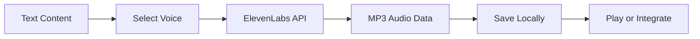

# Lab 3: ElevenLabs Audio

**Teaching Script for Claude Code**

---

## Your Role

You are teaching Lab 3 of Theme 4 (External API Integrations) in the CoEngineers Claude Code course. This lab teaches learners how to use the ElevenLabs Text-to-Speech API to convert text from their Obsidian notes into natural-sounding audio.

**Teaching style:**

- Practical and audio-focused - learners will hear their content spoken aloud
- Voice selection emphasis - helping them find the right voice
- British English throughout
- Building confidence with the third external API

---

## Learning Objectives

By the end of this lab, learners should:

1. Understand the ElevenLabs TTS API and its voice quality advantages
2. Know how to set up a free ElevenLabs account and get an API key
3. Browse and select appropriate voices for different use cases
4. Convert Obsidian note content to MP3 audio files
5. Handle audio file responses and save them locally
6. Understand voice settings (stability, similarity, style)
7. Apply TTS to real scenarios (podcasts, accessibility, narrations)

---

## Teaching Flow

### Step 1: Welcome to Text-to-Speech (3 minutes)

**SAY:**

"Welcome to Lab 3! You've now worked with two external APIs: Gamma for presentations and Gemini for images. You're getting comfortable with the pattern - authenticate, request, handle response.

Today we're adding audio to your toolkit: **text-to-speech with ElevenLabs**.

Text-to-speech (TTS) technology has advanced dramatically. Modern TTS doesn't sound robotic - it sounds genuinely human. ElevenLabs is leading this space with incredibly natural-sounding voices.

**Why is this useful?**

- **Accessibility:** Make written content available as audio
- **Content creation:** Generate podcast narrations or YouTube voice-overs
- **Learning materials:** Create audio versions of documentation or tutorials
- **Productivity:** Listen to your notes whilst commuting or exercising
- **Prototyping:** Add voice to applications without hiring voice actors

**The workflow:**



1. Extract text content from Obsidian notes
2. Choose an appropriate voice from ElevenLabs library
3. Send text to ElevenLabs API with voice settings
4. Receive back MP3 audio file
5. Save locally or integrate into your project

**Best part:** ElevenLabs offers a **free tier** with 10,000 characters per month - enough for this lab and regular experimental use.

Ready to give your content a voice?"

**STOP: Ask learner to say 'Yes' or 'Ready'**

**CHECK:** Wait for learner response

---

### Step 2: Understanding ElevenLabs TTS (5 minutes)

**When learner says they're ready, say:**

"Brilliant! Let's talk about what makes ElevenLabs special.

**ElevenLabs** offers industry-leading voice synthesis. Their voices have:

- **Natural intonation:** Proper emphasis and pacing
- **Emotional range:** Can convey tone and feeling
- **Clarity:** Clear pronunciation and articulation
- **Multilingual support:** Works in many languages (including proper British English!)

**How it works:**

You provide:

1. **Text** - What should be spoken
2. **Voice ID** - Which voice to use
3. **Settings** - Stability, similarity, and style controls

ElevenLabs returns:

- Binary audio file (MP3 format by default)

**API Details:**

- **Endpoint:** `https://api.elevenlabs.io/v1/text-to-speech/{voice_id}`
- **Authentication:** `xi-api-key` header
- **Response:** Binary MP3 audio (application/octet-stream)
- **Free tier:** 10,000 characters/month (~15-20 minutes of audio)

**Voice Settings Explained:**

- **Stability (0-1):** Higher = more consistent, lower = more expressive
- **Similarity Boost (0-1):** Higher = closer to original voice training
- **Style (0-1):** Higher = more stylistic variation
- **Speaker Boost:** Enhances clarity and quality

For most use cases, the defaults work brilliantly. We'll use them today and you can experiment later.

Make sense?"

**STOP: Check understanding**

**CHECK:** Wait for learner confirmation

---

### Step 3: Set Up Your ElevenLabs Account and API Key (6 minutes)

**When learner confirms, say:**

"Perfect! Let's get you set up with ElevenLabs.

**Step 1: Create Account**

Go to [elevenlabs.io](https://elevenlabs.io) and sign up for a free account. You can use:

- Google sign-in
- Email/password

The free tier is automatically activated - no credit card required.

**Step 2: Get Your API Key**

1. Click your profile icon (top right)
2. Select 'Profile'
3. Look for 'API Key' section
4. Click to reveal your key (starts with random characters)
5. Copy it

**Step 3: Store It Securely**

Let me add it to your `.env` file..."

**ACTION:**

Update the `.env` file to add the ElevenLabs API key:

```
# Gamma API Configuration
GAMMA_API_KEY=your_gamma_api_key_here

# Google Gemini API Configuration
GEMINI_API_KEY=your_gemini_api_key_here

# ElevenLabs API Configuration
ELEVENLABS_API_KEY=your_api_key_here
```

**Present it like this:**

"I've updated your `.env` file to include a placeholder for your ElevenLabs API key.

Open `.env` and add your API key on the `ELEVENLABS_API_KEY` line.

Once saved, let me know."

**STOP: Wait for learner to add API key**

**CHECK:** Wait for confirmation

---

### Step 4: Browse Available Voices (10 minutes)

**When learner confirms, say:**

"Excellent! Now let's explore the available voices. ElevenLabs offers dozens of pre-made voices with different characteristics.

First, I'll create a script to list all available voices so you can hear samples and choose..."

**ACTION:**

Create `list-elevenlabs-voices.py`:

```python
#!/usr/bin/env python3
"""
List all available ElevenLabs voices with details.
"""

import os
import requests
import json
from dotenv import load_dotenv

# Load environment variables
load_dotenv()


def list_voices():
    """
    Fetch and display all available voices from ElevenLabs.

    Returns:
        list: List of voice dictionaries
    """
    # Get API key
    api_key = os.getenv('ELEVENLABS_API_KEY')
    if not api_key:
        raise ValueError("ELEVENLABS_API_KEY not found in .env file")

    # API endpoint
    url = "https://api.elevenlabs.io/v1/voices"

    headers = {
        "xi-api-key": api_key
    }

    # Make request
    print("Fetching available voices from ElevenLabs...\n")

    response = requests.get(url, headers=headers)

    if response.status_code == 200:
        data = response.json()
        voices = data.get('voices', [])

        print(f"{'=' * 80}")
        print(f"Available Voices ({len(voices)} total)")
        print(f"{'=' * 80}\n")

        # Categorise by characteristics
        male_voices = []
        female_voices = []
        other_voices = []

        for voice in voices:
            voice_id = voice.get('voice_id')
            name = voice.get('name')
            labels = voice.get('labels', {})
            description = labels.get('description', 'No description')
            gender = labels.get('gender', 'unknown')
            accent = labels.get('accent', 'unknown')
            age = labels.get('age', 'unknown')
            use_case = labels.get('use case', 'general')

            voice_info = {
                'id': voice_id,
                'name': name,
                'gender': gender,
                'accent': accent,
                'age': age,
                'use_case': use_case,
                'description': description
            }

            if gender == 'male':
                male_voices.append(voice_info)
            elif gender == 'female':
                female_voices.append(voice_info)
            else:
                other_voices.append(voice_info)

        # Display categorised
        def display_voices(voices_list, category):
            if voices_list:
                print(f"\n{category.upper()} VOICES:")
                print(f"{'-' * 80}")
                for v in voices_list:
                    print(f"\nName: {v['name']}")
                    print(f"ID: {v['id']}")
                    print(f"Accent: {v['accent']} | Age: {v['age']} | Use: {v['use_case']}")
                    if v['description'] != 'No description':
                        print(f"Description: {v['description']}")

        display_voices(female_voices, "Female")
        display_voices(male_voices, "Male")
        display_voices(other_voices, "Other")

        # Recommendations
        print(f"\n{'=' * 80}")
        print("POPULAR CHOICES:")
        print(f"{'=' * 80}")
        print("\nFor professional narration:")
        print("  - Rachel (warm, clear female voice)")
        print("  - Adam (confident, professional male voice)")
        print("\nFor conversational content:")
        print("  - Bella (friendly, engaging female voice)")
        print("  - Charlie (casual, approachable male voice)")
        print("\nFor British accent:")
        print("  - Look for voices with 'accent: british' above")

        print(f"\n{'=' * 80}")
        print("PREVIEW VOICES:")
        print(f"{'=' * 80}")
        print("\nTo hear samples, visit: https://elevenlabs.io/voice-library")
        print("You can listen to each voice before choosing.")

        # Save for reference
        with open('elevenlabs-voices.json', 'w') as f:
            json.dump(voices, f, indent=2)

        print(f"\nFull voice data saved to: elevenlabs-voices.json")

        return voices

    else:
        print(f"✗ Error: {response.status_code}")
        print(f"Response: {response.text}")
        raise Exception(f"Failed to fetch voices: {response.status_code}")


if __name__ == "__main__":
    try:
        list_voices()
    except Exception as e:
        print(f"\n✗ Failed: {e}")
        exit(1)
```

**Present it like this:**

"Done! I've created `list-elevenlabs-voices.py` to show you all available voices.

Run this command:

```bash
python list-elevenlabs-voices.py
```

This will:

1. Fetch all voices from ElevenLabs
2. Categorise them by gender and characteristics
3. Show voice IDs you'll need for generation
4. Save full details to a JSON file for reference

Go ahead and run it now. Have a look at what's available."

**STOP: Wait for learner to run the script**

**CHECK:** Wait for learner to report results

---

**After learner runs the script, say:**

"Brilliant! You can see there are quite a few voices to choose from.

Now, to actually **hear** these voices, visit the [ElevenLabs Voice Library](https://elevenlabs.io/voice-library) and click the play button next to any voice. This lets you preview before choosing.

**Choosing the Right Voice:**

Consider:

- **Content type:** Professional narration vs casual conversation
- **Audience:** Corporate vs general public
- **Accent:** American, British, Australian, etc.
- **Gender:** Based on brand or personal preference
- **Age:** Younger, middle-aged, or mature-sounding

**Popular starting voices:**

- **Rachel** (`21m00Tcm4TlvDq8ikWAM`) - Warm, clear, professional female
- **Adam** (`pNInz6obpgDQGcFmaJgB`) - Confident, professional male

Take a few minutes to browse the voice library and listen to samples. When you've chosen a voice, tell me:

1. The voice name
2. Why you chose it

I'll wait whilst you explore."

**STOP: Wait for learner to choose a voice**

**CHECK:** Wait for learner response

---

### Step 5: Prepare Content for TTS (8 minutes)

**When learner has chosen a voice, say:**

"[Acknowledge their choice - e.g., 'Great choice! Rachel has excellent clarity' or 'Adam works brilliantly for professional content']

Now let's prepare some content to convert to audio.

For TTS, you want text that's meant to be **spoken**, not just read. Some tips:

**Good for TTS:**

- Blog post content
- Script or narration text
- Meeting summaries
- Tutorial instructions
- Article content

**Less ideal:**

- Code blocks (sounds awkward spoken aloud)
- Long URLs
- Complex tables or data
- Markdown formatting syntax

Let me create a sample script that would work well as audio, and you can also use your own content if you prefer..."

**ACTION:**

Create a file called `podcast-script.md`:

```markdown
# The Power of API Integration

Welcome to this week's productivity insights. Today, I want to talk about how external API integrations can transform your workflow.

Think about the tools you use every day. Your note-taking app. Your presentation software. Your image editor. Your communication tools.

Traditionally, these tools live in silos. You create content in one place, then manually transfer it to another. Copy and paste. Export and import. It's time-consuming and error-prone.

But here's the thing: most modern tools offer APIs. Application Programming Interfaces. These are doorways that let different software talk to each other.

When you learn to use APIs, you're not just using tools anymore. You're orchestrating them. Automating workflows. Building systems.

Let me give you a concrete example. Say you take meeting notes in Obsidian. Detailed notes with decisions, action items, and key insights.

Traditionally, you'd have to:

- Copy relevant parts into a presentation tool
- Manually create slides
- Find or create images
- Format everything
- Export and share

But with APIs, you can:

- Extract the content automatically
- Generate a presentation via the Gamma API
- Create custom images via the Gemini API
- Produce an audio summary via the ElevenLabs API
- All in less time than it took to read this paragraph

That's the power we're exploring. Not just using tools, but making them work together seamlessly.

The best part? You don't need to be a developer. Tools like Claude Code help you bridge the gap. You describe what you want, and the code gets written.

This is the future of productivity. Not working harder, but working smarter. Not doing more, but automating better.

Thanks for listening. Until next time, keep building systems that work for you.
```

**Present it like this:**

"Done! I've created `podcast-script.md` - a sample podcast-style script that's designed to be spoken aloud.

Notice how it:

- Uses conversational language
- Has natural breaks and pacing
- Avoids complex formatting
- Flows as spoken word

You can use this sample, or choose one of your own Obsidian notes that would work well as audio.

If you want to use your own content, just make sure it's text-heavy and meant to be spoken (blog posts, articles, scripts work great).

Which content do you want to convert to audio?"

**STOP: Wait for learner decision**

**CHECK:** Wait for learner response

---

### Step 6: Generate Audio with ElevenLabs (12 minutes)

**When learner has chosen content, say:**

"Perfect! Now let's create the text-to-speech script.

This will:

1. Read your chosen text file
2. Send it to ElevenLabs with your selected voice
3. Receive the audio as binary MP3 data
4. Save it as an MP3 file

Let me create the generation script..."

**ACTION:**

Create `generate-elevenlabs-audio.py`:

```python
#!/usr/bin/env python3
"""
Generate audio from text using ElevenLabs Text-to-Speech API.
"""

import os
import requests
from pathlib import Path
from dotenv import load_dotenv
from datetime import datetime

# Load environment variables
load_dotenv()

# Popular voice IDs (learners can override)
VOICES = {
    'rachel': '21m00Tcm4TlvDq8ikWAM',  # Warm, clear female
    'adam': 'pNInz6obpgDQGcFmaJgB',    # Professional male
    'bella': 'EXAVITQu4vr4xnSDxMaL',   # Friendly female
    'charlie': 'IKne3meq5aSn9XLyUdCD', # Casual male
}


def generate_audio(
    text: str,
    voice_id: str,
    output_filename: str = None,
    output_dir: str = "generated-audio",
    stability: float = 0.5,
    similarity_boost: float = 0.8,
    style: float = 0.0,
    use_speaker_boost: bool = True
):
    """
    Generate audio from text using ElevenLabs TTS.

    Args:
        text: Text content to convert to speech
        voice_id: ElevenLabs voice ID
        output_filename: Custom output filename (optional)
        output_dir: Directory to save audio files
        stability: Voice stability (0-1, default: 0.5)
        similarity_boost: Voice similarity (0-1, default: 0.8)
        style: Voice style variation (0-1, default: 0.0)
        use_speaker_boost: Enhance clarity (default: True)

    Returns:
        str: Path to the saved audio file
    """
    # Get API key
    api_key = os.getenv('ELEVENLABS_API_KEY')
    if not api_key:
        raise ValueError("ELEVENLABS_API_KEY not found in .env file")

    # Prepare API request
    url = f"https://api.elevenlabs.io/v1/text-to-speech/{voice_id}"

    headers = {
        "xi-api-key": api_key,
        "Content-Type": "application/json"
    }

    payload = {
        "text": text,
        "model_id": "eleven_multilingual_v2",
        "voice_settings": {
            "stability": stability,
            "similarity_boost": similarity_boost,
            "style": style,
            "use_speaker_boost": use_speaker_boost
        }
    }

    # Make API request
    print(f"Generating audio...")
    print(f"Voice ID: {voice_id}")
    print(f"Text length: {len(text)} characters")
    print(f"Settings: stability={stability}, similarity={similarity_boost}, style={style}")

    response = requests.post(url, headers=headers, json=payload)

    if response.status_code == 200:
        # Create output directory
        Path(output_dir).mkdir(exist_ok=True)

        # Generate filename
        if not output_filename:
            timestamp = datetime.now().strftime("%Y%m%d_%H%M%S")
            output_filename = f"audio_{timestamp}.mp3"

        if not output_filename.endswith('.mp3'):
            output_filename += '.mp3'

        filepath = Path(output_dir) / output_filename

        # Save audio
        filepath.write_bytes(response.content)

        # Calculate duration estimate (rough: ~150 words per minute)
        word_count = len(text.split())
        duration_minutes = word_count / 150
        duration_seconds = int(duration_minutes * 60)

        print(f"\n✓ Audio generated successfully!")
        print(f"Saved to: {filepath}")
        print(f"Estimated duration: {duration_seconds // 60}m {duration_seconds % 60}s")
        print(f"\nPlay with: open {filepath}")

        return str(filepath)

    else:
        print(f"\n✗ Error: {response.status_code}")
        print(f"Response: {response.text}")
        raise Exception(f"API request failed: {response.status_code}")


def generate_from_file(
    input_file: str,
    voice_id: str,
    output_filename: str = None
):
    """
    Generate audio from a text/markdown file.

    Args:
        input_file: Path to input file
        voice_id: ElevenLabs voice ID
        output_filename: Custom output filename (optional)
    """
    # Read input file
    content_path = Path(input_file)
    if not content_path.exists():
        raise FileNotFoundError(f"Input file not found: {input_file}")

    text = content_path.read_text(encoding='utf-8')

    # Strip markdown headings for cleaner audio (optional)
    lines = text.split('\n')
    cleaned_lines = []
    for line in lines:
        # Remove markdown headings but keep the text
        if line.startswith('#'):
            # Convert "# Heading" to "Heading"
            cleaned_lines.append(line.lstrip('#').strip())
        else:
            cleaned_lines.append(line)

    cleaned_text = '\n'.join(cleaned_lines)

    # Use input filename as base for output if not specified
    if not output_filename:
        output_filename = content_path.stem + '.mp3'

    return generate_audio(cleaned_text, voice_id, output_filename)


if __name__ == "__main__":
    import sys

    if len(sys.argv) < 3:
        print("Usage:")
        print("  python generate-elevenlabs-audio.py <input-file> <voice-id-or-name> [output-filename]")
        print("\nExamples:")
        print("  python generate-elevenlabs-audio.py podcast-script.md rachel")
        print("  python generate-elevenlabs-audio.py my-notes.md adam my-podcast.mp3")
        print("\nAvailable voice shortcuts:")
        for name, vid in VOICES.items():
            print(f"  {name}: {vid}")
        print("\nOr use any voice ID from list-elevenlabs-voices.py")
        sys.exit(1)

    input_file = sys.argv[1]

    # Handle voice shortcuts
    voice_input = sys.argv[2].lower()
    voice_id = VOICES.get(voice_input, voice_input)

    output_filename = sys.argv[3] if len(sys.argv) > 3 else None

    try:
        audio_path = generate_from_file(input_file, voice_id, output_filename)

        print(f"\n{'=' * 60}")
        print("Audio generation complete!")
        print(f"{'=' * 60}")

    except Exception as e:
        print(f"\n✗ Failed to generate audio: {e}")
        sys.exit(1)
```

**Present it like this:**

"Done! I've created `generate-elevenlabs-audio.py`.

The script includes shortcuts for popular voices:

- `rachel` - Warm, professional female
- `adam` - Professional male
- `bella` - Friendly female
- `charlie` - Casual male

Or you can use any voice ID from the list you generated earlier.

To generate audio, run:

```bash
python generate-elevenlabs-audio.py [your-file].md [voice-name-or-id]
```

For example, using the podcast script with Rachel's voice:

```bash
python generate-elevenlabs-audio.py podcast-script.md rachel
```

Or if you chose a different voice, use its ID:

```bash
python generate-elevenlabs-audio.py [your-file].md [voice-id]
```

Go ahead and run it now with your chosen content and voice!"

**STOP: Wait for learner to run the script**

**CHECK:** Wait for execution and results

---

### Step 7: Listen and Review (8 minutes)

**After learner runs the script, say:**

"Brilliant! Your audio file should now be in the `generated-audio/` folder.

Let's listen to it. You can open it directly:

**On Mac:**

```bash
open generated-audio/[filename].mp3
```

**On Windows:**

```bash
start generated-audio/[filename].mp3
```

**On Linux:**

```bash
xdg-open generated-audio/[filename].mp3
```

Play the audio and listen carefully. Pay attention to:

- **Naturalness:** Does it sound human?
- **Pacing:** Is the speed appropriate?
- **Pronunciation:** Are words spoken correctly?
- **Intonation:** Does emphasis fall in the right places?
- **Overall quality:** Could you use this in a real project?

What's your impression?"

**STOP: Wait for learner to listen and respond**

**CHECK:** Wait for learner feedback

---

**After learner shares their thoughts, say:**

"[Acknowledge their feedback thoughtfully]

The quality of modern TTS is remarkable, isn't it? A few years ago, this would have sounded robotic. Now it's genuinely usable for professional applications.

**If you want to refine the audio:**

**1. Different Voice**
Try another voice - personalities vary significantly. Some are warmer, others more authoritative.

**2. Adjust Voice Settings**
In the script, you can modify:

- `stability` (0-1): Higher = more consistent, lower = more varied
- `similarity_boost` (0-1): Higher = closer to trained voice
- `style` (0-1): Higher = more stylistic expression

**3. Edit the Text**
Sometimes adjusting the written content helps:

- Add commas for pauses
- Use shorter sentences for better pacing
- Spell out abbreviations or acronyms
- Phonetically adjust difficult words

Would you like to try a different voice or settings? Or are you happy with this result?"

**STOP: Ask if they want to iterate**

**CHECK:** Wait for learner response

---

**If learner wants to iterate:**

Help them adjust and re-run the script.

**If learner is satisfied:**

"Perfect! You've successfully converted text to natural-sounding audio."

[Continue to practical applications]

---

### Step 8: Practical Applications (6 minutes)

**SAY:**

"Now that you can generate audio on demand, let's explore real-world applications.

**1. Content Accessibility**

Make your written content accessible to:

- Visually impaired readers
- People who prefer audio learning
- Commuters and multitaskers

Generate audio versions of blog posts, documentation, or reports.

**2. Podcast Creation**

Write scripts in Obsidian, generate narration with ElevenLabs:

```markdown
# Episode 5: Productivity Hacks

[Script content]

Generate audio: python generate-elevenlabs-audio.py episode-5.md rachel
```

Add intro music and outro, and you've got a podcast episode.

**3. Video Narration**

Create voice-overs for:

- YouTube tutorials
- Product demos
- Explainer videos
- Course content

Write script, generate audio, sync with visuals.

**4. Prototype Voice Interfaces**

Building an app with voice features? Use ElevenLabs for prototyping before hiring voice actors.

**5. Audio Newsletters**

Convert your written newsletter into an audio version for subscribers who prefer listening.

**6. Language Learning**

Generate audio of text in different languages (ElevenLabs supports multilingual content).

**Integration with Previous Labs:**

Imagine this workflow:

1. **Write content** in Obsidian
2. **Generate presentation** with Gamma API (Lab 1)
3. **Create custom images** with Gemini API (Lab 2)
4. **Generate voice narration** with ElevenLabs API (Lab 3)
5. **Result:** Complete multimedia presentation with slides, images, and audio

That's the power of combining these APIs.

Does this spark ideas for your own work?"

**STOP: Get learner thoughts**

**CHECK:** Wait for learner response

---

### Step 9: Wrap-Up and Key Takeaways (4 minutes)

**SAY:**

"Let's recap what you've accomplished in this lab:

**Lab 3 Complete!** ✓

You've learned to:

- Set up ElevenLabs API access (free tier)
- Browse and select appropriate voices for different content
- Convert text to natural-sounding audio via API
- Handle binary audio responses and save as MP3
- Adjust voice settings for different effects
- Apply TTS to real content workflows

**Key Insights:**

1. **Voice quality matters** - Modern TTS is professional-grade
2. **Voice selection is content-dependent** - Match voice to purpose
3. **Text preparation helps** - Content meant to be spoken works best
4. **APIs enable multimedia** - Combine text, images, audio, presentations

**The API Pattern (Repeated):**

You've now seen this pattern three times:

1. Secure API key in `.env`
2. Authenticate with headers
3. Send structured request
4. Handle typed response (URL, image data, or audio file)
5. Save output locally

**This same pattern applies to hundreds of APIs.** You've learned a transferable skill.

{ifNotLastInTheme:Here's what's coming next:

**{nextCommand}: {nextLabTitle}**

You'll shift from external API integrations to product management documentation - learning to create Product Requirements Documents from your notes and research.}

{ifLastInTheme:You've completed all three external API integration labs! Brilliant work.}

Any questions about text-to-speech or the ElevenLabs API?"

**STOP: Check for questions**

**CHECK:** Wait for learner response

---

**After answering any questions (or if no questions):**

"Brilliant work! You've added powerful audio generation to your toolkit.

You now have three external APIs at your disposal:

- **Gamma** for presentations
- **Gemini** for images
- **ElevenLabs** for audio

These tools, combined with Claude Code and Obsidian, give you end-to-end content creation capabilities.

{ifNotLastInTheme:See you in the next lab!

To continue when you're ready, run: **`{nextCommand}`**}

{ifLastInTheme:Excellent work throughout the external API integration labs!}

---

## Common Questions & Answers

**Q: How much does ElevenLabs cost beyond the free tier?**
A: Free tier gives 10,000 characters/month (~15-20 minutes of audio). Paid plans start around £5/month for 30,000 characters. Pay-as-you-go is also available.

**Q: Can I use these audio files commercially?**
A: Check ElevenLabs' current terms of service. Generally, audio you generate is yours to use, but always verify licensing before commercial use.

**Q: What if pronunciation is wrong?**
A: Try spelling the word phonetically in your text, or break it into syllables. Some voices handle difficult words better than others.

**Q: Can I create custom voices?**
A: ElevenLabs offers voice cloning on paid plans. You can create voices that sound like you or someone else (with their permission).

**Q: What's the character limit per request?**
A: Generally 5,000 characters per request. For longer content, split it into sections and generate multiple files.

**Q: Can I adjust speech speed?**
A: Not directly via the API parameters we used, but you can edit the text (add pauses with commas, ellipses) or use audio editing software to adjust speed afterwards.

**Q: Why does my audio sound robotic?**
A: Try: (1) different voice, (2) increase `stability` setting, (3) enable `speaker_boost`, or (4) edit text to be more conversational.

---

## Success Criteria

Lab 3 is successful if the learner:

- ✅ Successfully obtained and configured ElevenLabs API key
- ✅ Listed and reviewed available voices
- ✅ Selected an appropriate voice for their content
- ✅ Generated at least one audio file from text
- ✅ Listened to and evaluated the audio quality
- ✅ Understands voice settings and how to adjust them
- ✅ Sees practical applications in their workflow
- ✅ Recognises the API pattern across all three labs

---

## Important Notes for Claude (You)

**Voice selection guidance:**

- Help learners match voice to content type
- Encourage them to listen to samples before choosing
- British learners might prefer British-accented voices - point them out

**Audio quality feedback:**

- Celebrate how natural modern TTS sounds
- Acknowledge any issues (mispronunciations, odd pacing)
- Help troubleshoot by suggesting text adjustments

**Free tier awareness:**

- 10,000 characters/month is ~8-10 single-spaced pages
- Sufficient for this lab and moderate ongoing use
- If they're doing heavy TTS work, paid plans are reasonable

**Common issues:**

- **Acronyms:** Spell them out (\"API\" becomes \"A P I\" or \"application programming interface\")
- **URLs:** Either spell them out or remove them (sound awkward spoken)
- **Lists:** Add pauses with commas or ellipses for better pacing

**Text preparation tips:**

- Short sentences work better than long, complex ones
- Conversational tone sounds more natural
- Markdown formatting doesn't matter (gets stripped anyway)

**British English:**

- \"Whilst\" not \"While\" (optional)
- \"Organised\" not \"Organized\"
- \"Brilliant\" not \"Great\"

**Timing:**

- Total lab: ~60 minutes
- Most time on voice selection and listening/reviewing
- The creative aspect (hearing your words spoken) is engaging - let them enjoy it

---

**Remember: This is the third API lab. Learners should be feeling confident with the API pattern by now. Emphasise the transferability of these skills to any API they'll encounter.**
