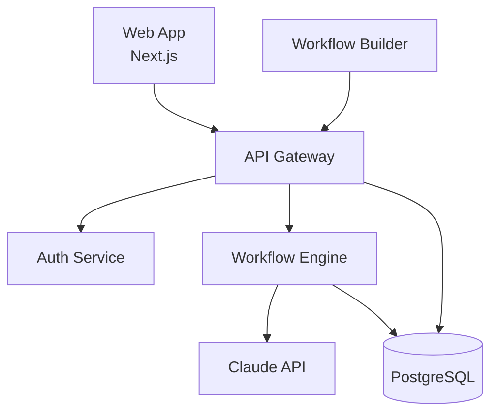

# Diagram Requirements: CoEngine Product Architecture

## Overview

Create comprehensive Mermaid diagrams documenting CoEngine's product architecture for our internal engineering wiki and new developer onboarding.

**Purpose:** Help engineers understand how our systems connect and data flows through the platform.

**Audience:**

- New engineering hires (onboarding)
- Current engineers (reference documentation)
- Technical stakeholders (product/leadership)

## Diagram 1: System Architecture Overview

### Purpose

High-level view of how all major components connect. Should be understandable in under 2 minutes.

### Components to Include

**Frontend:**

- Web App (Next.js)
- Visual Workflow Builder (React)
- Dashboard (Admin/User)

**Backend Services:**

- API Gateway (Node.js/Express)
- Authentication Service
- Workflow Engine
- Template Service
- Analytics Service

**External Services:**

- Claude API (Anthropic)
- Supabase (Database + Auth)
- Vercel (Hosting)
- Resend (Email)
- Stripe (Payments)

**Data Storage:**

- PostgreSQL (User data, workflows)
- Redis (Session cache)
- S3 (File storage)

### Required Elements

- Show directional data flow (arrows)
- Indicate API vs database connections
- Highlight which services are critical path
- Use colour coding: Frontend (blue), Backend (purple), External (grey)

### Diagram Type

Flowchart or architecture diagram showing system components and connections.

---

## Diagram 2: User Workflow Creation Flow

### Purpose

Detail the complete journey from when a user creates a workflow in the visual builder to when it's deployed as a slash command.

### Steps to Document

1. **User Action:** Opens workflow builder in web app
2. **UI Interaction:** Drags nodes onto canvas, connects them
3. **Validation:** Frontend validates workflow structure
4. **Save Draft:** Sends workflow JSON to API
5. **API Processing:** Validates and stores in database
6. **Test Mode:** User runs workflow with sample data
7. **Execution:** Workflow engine processes steps
8. **Claude Integration:** Workflow engine calls Claude API
9. **Result Display:** Results returned to user
10. **Deployment:** User clicks "Deploy to slash command"
11. **Code Generation:** Backend converts workflow to slash command code
12. **File Update:** CLAUDE.md file updated in user's project
13. **Confirmation:** User receives success notification

### Required Elements

- Decision points (e.g., "Valid workflow?" yes/no)
- Error handling paths
- Async operations (where user waits)
- Database writes (show persistence points)

### Diagram Type

Flowchart or sequence diagram showing the step-by-step process.

---

## Diagram 3: Data Model - Database Schema

### Purpose

Show relationships between key database tables for engineers working with data.

### Tables to Include

**Users:**

- id, email, name, created_at, subscription_tier

**Workspaces:**

- id, name, owner_id, team_members[], created_at

**Workflows:**

- id, workspace_id, name, description, nodes[], connections[], status, created_at, updated_at

**Templates:**

- id, name, category, workflow_data, author_id, is_public, downloads_count

**Executions:**

- id, workflow_id, user_id, status, started_at, completed_at, error_message

**Analytics_Events:**

- id, user_id, workflow_id, event_type, metadata, timestamp

### Required Elements

- Primary keys and foreign keys
- Relationship types (one-to-many, many-to-many)
- Critical indices
- Key constraints

### Diagram Type

Entity-relationship diagram (ERD).

---

## Diagram 4: Workflow Execution Sequence

### Purpose

Show exactly what happens when a workflow executes - the detailed internal process.

### Actors/Components

- User
- Web App
- API Gateway
- Workflow Engine
- Claude API
- Database
- File System

### Sequence Steps

1. User triggers workflow (via UI or slash command)
2. API Gateway receives request, authenticates user
3. Fetches workflow definition from database
4. Workflow Engine initialized with workflow steps
5. **For each step:**
   - Read step configuration
   - Execute step logic
   - If step involves Claude: Call Claude API with context
   - Wait for response
   - Store intermediate results
   - Update execution status
6. Handle errors/retries if any step fails
7. Compile final results
8. Store execution record in database
9. Return results to user
10. Update analytics

### Required Elements

- Time progression (sequence)
- Sync vs async operations
- Error handling paths
- Loop for step iteration

### Diagram Type

Sequence diagram showing time-based interactions between components.

---

## Diagram 5: Authentication & Authorization Flow

### Purpose

Document how we handle user authentication and permission checking.

### Flows to Show

**Sign-Up Flow:**

1. User submits email/password
2. API creates user in Supabase
3. Sends verification email (via Resend)
4. User clicks verification link
5. Redirect to onboarding
6. Create default workspace

**Sign-In Flow:**

1. User submits credentials
2. Supabase authenticates
3. Returns JWT token
4. Frontend stores in httpOnly cookie
5. Redirect to dashboard

**Protected Resource Access:**

1. User requests resource (e.g., workflow)
2. API extracts JWT from request
3. Verifies token with Supabase
4. Checks user permissions (owns resource or has workspace access)
5. If authorized: Return resource
6. If not: Return 403 error

### Required Elements

- Token flow
- Decision points (authorized? yes/no)
- Error states
- Different authentication methods (email/password, OAuth in future)

### Diagram Type

Flowchart or sequence diagram.

---

## Diagram 6: Template Marketplace Architecture

### Purpose

Show how the template marketplace works (launching Q2 - need to design now).

### Components

**Creators:**

- Template authors who upload workflows

**Marketplace:**

- Browse/search interface
- Rating/review system
- Purchase flow

**Distribution:**

- Template delivery to buyers
- License management
- Revenue sharing

### Flow to Document

1. Creator builds workflow in builder
2. Creator submits to marketplace (with metadata, screenshots)
3. Review process (automated + manual check)
4. Approved templates go live
5. User browses marketplace
6. User purchases/downloads template
7. Template imported to user's workspace
8. Creator earns revenue share
9. Analytics tracked

### Required Elements

- Actor swimlanes (Creator, User, Platform)
- Payment flow
- Review gates
- Data transformations

### Diagram Type

Swimlane diagram showing different actors and their interactions.

---

## Diagram 7: CI/CD Pipeline

### Purpose

Document our deployment process for engineering team.

### Pipeline Stages

**1. Development:**

- Developer pushes to feature branch
- GitHub Actions triggered

**2. CI Checks:**

- Run tests (unit, integration)
- Lint code
- Build Next.js app
- Run security scans

**3. Preview Deployment:**

- Deploy to Vercel preview environment
- Run E2E tests against preview
- Post preview URL to PR

**4. Code Review:**

- Team reviews code
- Required checks must pass
- Approval required

**5. Merge to Main:**

- Squash and merge
- Triggers production pipeline

**6. Production Deployment:**

- Build production bundle
- Run database migrations (if any)
- Deploy to Vercel production
- Run smoke tests
- Health check

**7. Post-Deployment:**

- Monitor error rates
- Check performance metrics
- Auto-rollback if error threshold exceeded

### Required Elements

- Automated vs manual steps
- Failure paths (what happens if tests fail?)
- Parallel vs sequential stages
- Approval gates

### Diagram Type

Flowchart or pipeline diagram.

---

## Technical Specifications

### Mermaid Syntax

All diagrams must use Mermaid.js syntax (https://mermaid.js.org/).

**Supported diagram types:**

- `flowchart` (use `flowchart TD` for top-down or `flowchart LR` for left-right)
- `sequenceDiagram`
- `erDiagram`
- `gitGraph` (if relevant for CI/CD)
- `journey` (if useful for user flows)

### Style Guidelines

**Consistency:**

- Use same shape conventions across diagrams (rectangles for processes, diamonds for decisions, etc.)
- Consistent colour coding (Frontend = blue, Backend = purple, External = grey)
- Consistent naming (use actual service names, not generic labels)

**Readability:**

- Maximum 15-20 nodes per diagram (break complex flows into multiple diagrams)
- Clear, descriptive labels (not cryptic abbreviations)
- Left-to-right or top-to-bottom flow (no circular layouts)
- Group related components with subgraphs where appropriate

**Documentation:**

- Each diagram should have a title
- Include brief description above the Mermaid code
- Add notes for any non-obvious relationships
- Date diagrams and commit to version control

### Output Format

For each diagram, provide:

1. **Title and description** (2-3 sentences explaining what the diagram shows)
2. **Mermaid code** (properly formatted, ready to paste into Markdown)
3. **Key insights** (bullet points highlighting important details)
4. **Related diagrams** (references to other diagrams that provide additional context)
5. **Maintenance notes** (what triggers need to update this diagram)

### Example Format

````markdown
## Diagram 1: System Architecture Overview

High-level view of CoEngine's system architecture showing how frontend, backend, and external services connect. Illustrates data flow and critical dependencies.


````

**Key Insights:**

- All client requests go through API Gateway (single entry point)
- Workflow Engine is core service - handles all workflow execution
- Claude API is external dependency - need proper error handling
- Database used for persistence and session management

**Related Diagrams:**

- See Diagram 2 for detailed workflow creation flow
- See Diagram 4 for workflow execution internals

**Maintenance:**

- Update when new services are added
- Review quarterly for accuracy
- Update if major architecture changes occur

```

## Success Criteria

Diagrams should:
- Be accurate (reflect actual current architecture)
- Be understandable (new engineers can follow them)
- Be maintainable (easy to update as system evolves)
- Be comprehensive (cover all major workflows and components)
- Follow Mermaid best practices (valid syntax, renders correctly)

## Deliverable

Provide all 7 diagrams with:
- Mermaid code ready to paste into Markdown
- Supporting documentation as specified
- Verification that code renders correctly in Mermaid preview

## Timeline

All diagrams needed by end of week for inclusion in engineering wiki.

## Additional Context

- These will be our primary architectural documentation
- New hires will use these during onboarding
- We'll maintain in GitHub (version controlled)
- Plan to generate these from code in future (Infrastructure as Diagrams)
- Current architecture is still evolving - diagrams will need regular updates
```
