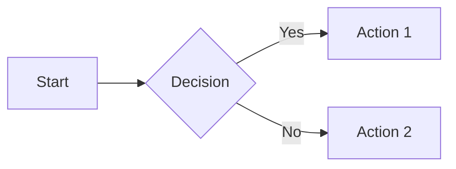
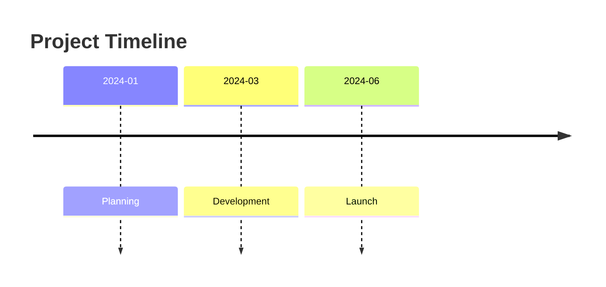
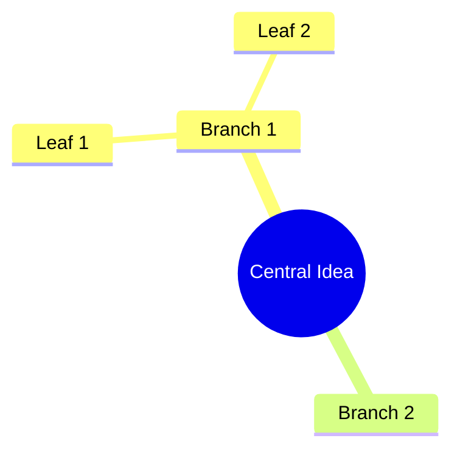

import YouTube from '../../../components/YouTube.astro';
import SlashCommand from '../../../components/SlashCommand.astro';

{/* TODO: Add video ID when uploaded */}
{/* <YouTube id="VIDEO_ID_HERE" title="Day 18: Diagram Generator" /> */}

## What You'll Learn

- Create flowcharts and process diagrams
- Build relationship diagrams
- Generate timelines and sequences
- Use Mermaid syntax effectively

## The Scenario

Fiona wants to explain the whisky-making process to visitors. Old Hamish knows every step but it's all in his head. Time to visualise it.

## The Slash Command

<SlashCommand code="/w3.d18" />

This command guides you through an **interactive walkthrough** to create clear diagrams from plain text descriptions.

### What the Command Does

1. **Asks what you're visualising** - A process, relationships, timeline?
2. **Gets the details** - What are the steps or elements?
3. **Chooses diagram type** - Flowchart, sequence, mindmap, etc.
4. **Specifies the audience** - Technical or general?
5. **Creates Mermaid code** - Ready to render

### Diagram Types

1. **Flowchart** - Processes with decisions
2. **Sequence** - Step-by-step interactions
3. **Timeline** - Events over time
4. **Entity Relationship** - How things connect
5. **Mindmap** - Hierarchical ideas

## Mermaid Syntax Quick Reference

**Flowchart:**

**Timeline:**

**Mindmap:**

## Where Mermaid Renders

- Obsidian (built-in)
- VS Code (with extension)
- GitHub markdown
- Many documentation tools

## Example Output

A complete Mermaid diagram with:
- Valid syntax ready to render
- Brief explanation of the diagram
- Suggestions for improvements
- Alternative diagram types if applicable

## Tips for Success

- **Start simple** - Add complexity after it works
- **Describe the flow** - Claude will translate to syntax
- **Test rendering** - Paste into Obsidian or GitHub
- **Keep it readable** - Too many nodes = confusion

## What You Learned

- Text → diagram with Mermaid
- Multiple diagram types for different needs
- Renders in most documentation tools
- No design skills required

## What's Next?

Tomorrow in [Day 19: Social Thread Maker](/week-3/day-19-social-thread-maker/), we'll create social media content from long-form notes.

---
Day 18 of 31 | CoEngineers.ai
