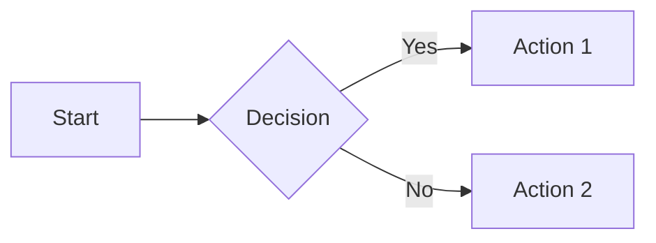
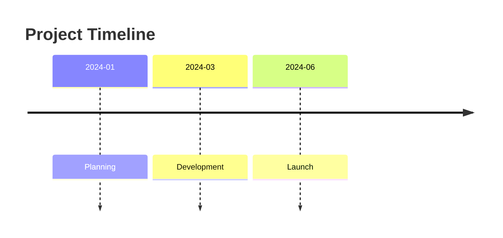
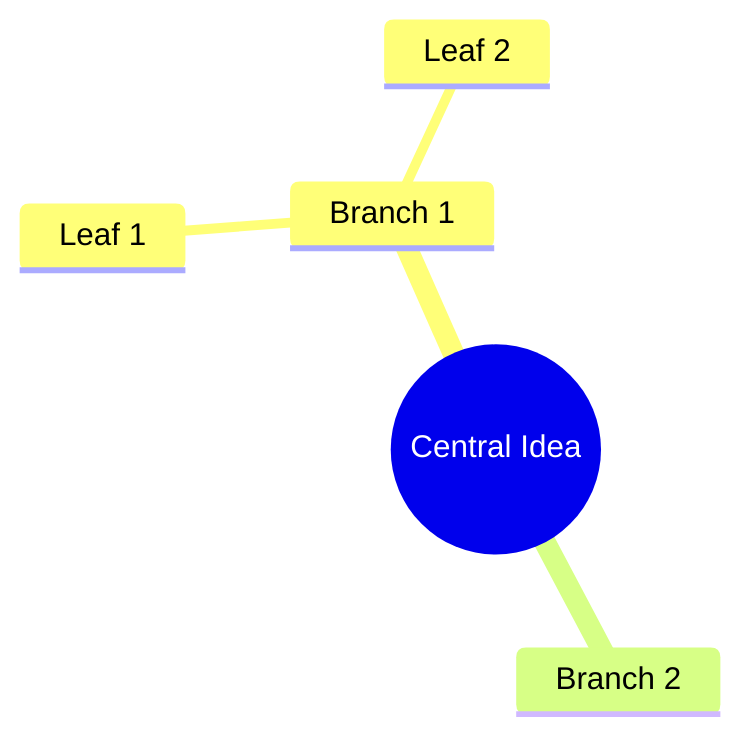

import YouTube from '../../../components/YouTube.astro';
import SlashCommand from '../../../components/SlashCommand.astro';

{/* TODO: Add video ID when uploaded */}
{/* <YouTube id="VIDEO_ID_HERE" title="Day 18: Diagram Generator" /> */}

## What You'll Learn

- Create flowcharts and process diagrams
- Build relationship diagrams
- Generate timelines and sequences
- Use Mermaid syntax effectively

## The Scenario

Fiona wants to explain the whisky-making process to visitors. Old Hamish knows every step but it's all in his head. Time to visualise it.

## The Slash Command

<SlashCommand code="/w3.d18" />

Create clear diagrams from plain text descriptions.

### What We're Building
Process diagrams, flowcharts, and relationship maps using Mermaid syntax.

### The Scenario
Old Hamish has made whisky for 40 years. The process is in his head. We need to document it visually before he retires.

### Mermaid Basics

Mermaid creates diagrams from text. Renders in:
- Obsidian (built-in)
- VS Code (with extension)
- GitHub markdown
- Many documentation tools

### Diagram Types

1. **Flowchart** - Processes with decisions
2. **Sequence** - Step-by-step interactions
3. **Timeline** - Events over time
4. **Entity Relationship** - How things connect
5. **Mindmap** - Hierarchical ideas

### Let's Go

#### Step 1: Create the Diagram Generator
"Create a slash command at .claude/commands/create-diagram.md:

# Create Mermaid Diagram

You are helping me create diagrams using Mermaid syntax.

## Input
I'll describe:
- What I want to visualise
- The type of diagram (or ask for recommendation)
- Level of detail needed

## Your Task
Create a Mermaid diagram with:

1. **Appropriate type** - Match the content to the right diagram
2. **Clear labels** - Readable node/edge text
3. **Logical flow** - Left-to-right or top-to-bottom
4. **Proper syntax** - Valid Mermaid code

## Output Format
Provide:
- The Mermaid code block
- Brief explanation of the diagram
- Suggestions for improvements
- Alternative diagram type if applicable

Code should be in a mermaid code block for easy rendering."

#### Step 2: The Whisky-Making Process
"Create a flowchart showing the whisky-making process:

1. Malting - Barley is soaked and germinated
2. Mashing - Ground malt mixed with hot water
3. Fermentation - Yeast added, creates wash
4. Distillation - Wash heated in copper stills (x2)
5. Maturation - Stored in oak casks for years
6. Bottling - Final product

Show the main flow with brief descriptions.
Save to week-3-outputs/whisky-process-diagram.md"

#### Step 3: Create Different Diagram Types
"Using the same whisky-making content, create:

1. A timeline showing the process duration
   - Malting: 3 days
   - Mashing: 8 hours
   - Fermentation: 3 days
   - Distillation: 1 day
   - Maturation: 12 years
   - Bottling: 1 day

2. A mindmap of all the factors affecting whisky quality

Save both to week-3-outputs/"

#### Step 4: Create a Sequence Diagram
"Create a sequence diagram showing the customer journey:

1. Customer discovers Thistle & Thorn (website/social)
2. Customer signs up for newsletter
3. Customer receives welcome email
4. Customer books distillery tour
5. Customer visits and tastes
6. Customer purchases whisky
7. Customer shares on social media
8. New customer discovers via share

Show the interactions between Customer, Website, Email, and Staff."

#### Step 5: Quick Diagram Command
"Create a slash command create-flowchart.md that just creates flowcharts from a list of steps. Ultra simple input format."

### Mermaid Syntax Quick Reference

**Flowchart:**

**Timeline:**

**Mindmap:**

### Your Turn
Create a diagram for something in your work:
- A process you follow
- A decision tree
- A project timeline
- An organisational structure

### What You Learned
- Text → diagram with Mermaid
- Multiple diagram types for different needs
- Renders in most documentation tools
- No design skills required

## Example Outputs

- `.claude/commands/create-diagram.md`
- `.claude/commands/create-flowchart.md`
- `whisky-process-diagram.md`
- Timeline and mindmap diagrams

## What's Next?

Tomorrow in [Day 19: Social Thread Maker](/week-3/day-19-social-thread-maker/), we'll create social media content from long-form notes.

---
Day 18 of 31 | CoEngineers.ai
